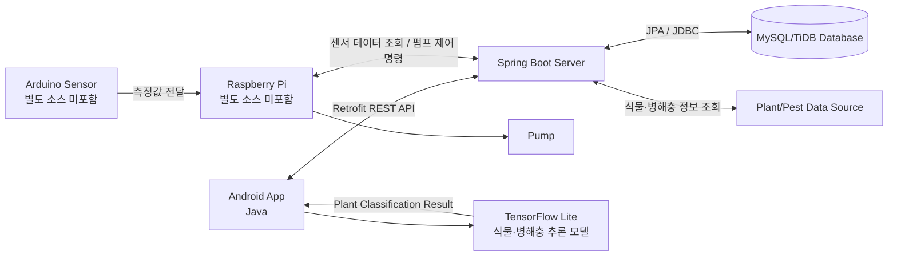

# Smart Farm

## 프로젝트 소개

스마트팜 환경을 모바일에서 확인하고 관리할 수 있는 **Android 애플리케이션 및 백엔드 시스템**입니다. 사용자는 앱에서 온도·습도·토양 수분 데이터를 확인하고, 센서 변화 추이를 차트로 조회할 수 있습니다. 또한 서버를 통해 펌프를 원격으로 제어하고, 식물·병해충 도감과 성장일기 기능을 이용할 수 있습니다. 비로그인 사용자도 식물·병해충 도감은 이용할 수 있도록 구성했습니다.

이 프로젝트는 졸업작품으로 진행한 팀 프로젝트입니다. 저는 프로젝트에서 **Android 앱, Spring Boot 서버, 데이터베이스 구축 및 전체 시스템 연동**을 담당했습니다.

> 이 저장소는 졸업작품 전체 소스가 아니라, 제가 담당한 앱·서버·DB 구현을 중심으로 공개한 저장소입니다. Arduino와 Raspberry Pi의 원본 소스 코드, 식물 이미지 학습 데이터 및 학습 코드는 저장소 공개 범위에서 제외되어 있습니다.

## 담당 역할

### 제가 담당한 부분

- Android 스마트팜 앱 구축

- Spring Boot 기반 REST API 서버 구축

- 데이터베이스 설계 및 JPA 연동

- Android 앱과 서버 간 Retrofit 통신 구현

- 회원가입·로그인·로그아웃 기능 구현

- BCrypt를 이용한 비밀번호 암호화 저장 및 검증

- 센서 데이터 조회 및 기기별 데이터 처리

- 센서 데이터의 현재값·평균값 표시 및 차트 시각화

- 펌프 제어 API와 하드웨어 제어 엔드포인트 연동

- 펌프 제어 이력 및 현재 상태 저장

- 펌프 자동 안전 정지 로직 구현

- 식물·병해충 검색 기능 구현

- 성장일기 및 폴더 관리 기능 구현

- 동료가 학습한 식물·병해충 TensorFlow Lite 모델의 Android 앱 적용

- 이미지 분류 결과를 식물·병해충 검색 기능으로 연결

앱은 로그인 여부에 따라 이용 가능한 기능을 구분합니다. 비로그인 사용자는 식물·병해충 도감에 접근할 수 있고, 센서 데이터 조회·펌프 제어·성장일기 기능은 로그인 후 이용하도록 구성했습니다.

### 동료 담당 부분

- Arduino와 Raspberry Pi를 활용한 센서 측정 장치 구성

- 카메라를 활용한 식물·병해충 이미지 수집

- 식물·병해충 이미지 분류 모델 학습

- TensorFlow Lite 모델 생성 및 학습 과정

동료들이 담당한 하드웨어 및 모델 학습 결과를 앱과 서버에서 사용할 수 있도록 연결하는 것이 제가 담당한 주요 통합 작업이었습니다. 사용자는 식물이나 병해충 이름을 직접 입력하지 않고 카메라로 촬영하거나 사진을 선택할 수 있으며, 앱은 학습된 TensorFlow Lite 모델의 분류 결과를 검색어로 사용하여 식물 또는 병해충 정보를 조회합니다.

## 주요 기능

### 1. 회원 관리

- 아이디 중복 확인

- 회원가입 및 로그인

- BCrypt 기반 비밀번호 암호화 저장

- 암호화된 비밀번호 검증

- 로그인 사용자 정보 저장

- 로그아웃 시 사용자 정보 삭제

### 비로그인 식물·병해충 도감 조회

- 비로그인 상태에서 식물·병해충 도감 접근

- 농촌진흥청 공공 API 기반 식물·병해충 정보 조회

- 식물명 및 병해충명 검색

### 2. 스마트팜 센서 모니터링

- 기기별 센서 데이터 조회

- 온도, 습도, 토양 수분 데이터 표시

- 현재 측정값과 평균값 표시

- MPAndroidChart 기반 센서 변화 그래프 제공

- 사용자 ID와 기기 ID를 기준으로 데이터 분리

센서 측정은 Arduino와 Raspberry Pi 장치에서 수행하며, 해당 장치의 원본 코드는 이 저장소에 포함하지 않았습니다. 이 저장소에는 서버에서 센서 데이터를 관리하고 Android 앱에 제공하는 소프트웨어 영역을 공개했습니다.

### 3. 펌프 원격 제어 및 안전 정지

- Android 앱에서 펌프 켜기·끄기 명령 전송

- 서버에서 펌프 제어 명령 처리

- 기기별 펌프 상태 저장

- 제어 요청자, 대상 기기, 요청 상태, 실행 시간 기록

- 제어 성공·실패 이력 관리

- Raspberry Pi의 하드웨어 제어 엔드포인트와 HTTP 통신

- 앱 응답이 중단되는 상황을 고려한 서버 측 자동 안전 정지

펌프가 켜진 뒤 일정 시간 동안 앱의 추가 응답이 없으면 서버가 자동으로 정지 명령을 실행하도록 구현했습니다. 이를 통해 네트워크 연결이나 앱 상태에 문제가 발생하더라도 펌프가 계속 동작하는 상황을 줄이고자 했습니다.

### 4. 식물·병해충 도감

- 식물 및 병해충 이름 검색

- 농촌진흥청 API를 통한 식물·병해충 정보 조회

- 서버에 저장된 사용자 정의 식물·병해충 사전 검색

- 식물 및 병해충 상세 정보와 이미지 표시

- 카메라 촬영 또는 갤러리 이미지 선택

- TensorFlow Lite 모델을 이용한 식물·병해충 이미지 추론

- 식물 분류 결과를 검색어로 사용한 식물 정보 자동 조회

- 병해충 분류 결과를 검색어로 사용한 병해충 정보 자동 조회

식물·병해충 도감은 비로그인 사용자도 이용할 수 있도록 구성했습니다. 외부 API 조회에 실패하더라도 사용자 정의 도감 조회를 이어서 수행하도록 하여 하나의 데이터 출처에 문제가 생겨도 검색 기능을 계속 사용할 수 있도록 했습니다. 검색 결과는 RecyclerView로 표시하며, 이미지와 상세 정보를 함께 제공합니다.

### 5. 성장일기 및 폴더 관리

- 성장일기 작성 및 저장

- 일기 목록 조회

- 날짜순 타임라인 조회

- 일기 폴더 생성 및 삭제

- 폴더별 일기 조회

- 폴더 삭제 시 포함된 일기 함께 삭제

## 시스템 구성



## 기술 스택

| 구분 | 기술 |
| --- | --- |
| Mobile | Android, Java, XML Layout |
| Android UI | AndroidX, Material Components, ConstraintLayout, RecyclerView |
| Network | Retrofit 2, Gson, OkHttp |
| Image | Glide, uCrop |
| Chart | MPAndroidChart |
| On-device AI | 식물·병해충 TensorFlow Lite 모델 연동 |
| Backend | Java 17, Spring Boot 3.2.1 |
| Persistence | Spring Data JPA, Hibernate |
| Database | MySQL 호환 DB, TiDB 연결 설정 |
| Security | Spring Security, BCryptPasswordEncoder |
| Hardware Integration | Raspberry Pi HTTP 엔드포인트 연동 |
| Build | Gradle, Maven |

## 프로젝트 구조

```
smartfarm-1/
├── android/
│   └── SmartFarmApp/
│       └── app/src/main/
│           ├── java/com/example/smartfarmapp/
│           │   ├── activity/       # 로그인, 메인, 센서, 검색, 일기 화면
│           │   ├── adapter/        # RecyclerView 어댑터
│           │   ├── ai/             # TensorFlow Lite 모델 실행 및 결과 처리
│           │   ├── model/          # 앱 데이터 모델
│           │   ├── network/        # Retrofit 클라이언트
│           │   └── service/        # API 서비스 및 펌프 안전 서비스
│           ├── assets/              # 식물·병해충 추론용 TFLite 모델 및 label 파일
│           └── res/                 # 화면 레이아웃 및 리소스
├── server/
│   └── SmartFarmServer/
│       └── src/main/java/com/example/smartfarmserver/
│           ├── config/              # Spring Security 설정
│           ├── controller/          # REST API 컨트롤러
│           ├── dto/                 # 요청·응답 객체
│           ├── entity/              # JPA 엔티티
│           ├── repository/           # 데이터 접근 계층
│           ├── service/              # 기기 제어 및 비즈니스 로직
│           └── util/                 # XML 파싱 유틸리티
└── DB.sql                            # 데이터베이스 스키마 및 초기 데이터
```

## 주요 API

| 기능 | Method | Endpoint |
| --- | --- | --- |
| 아이디 중복 확인 | GET | `/api/member/check-id` |
| 로그인 | POST | `/api/member/login` |
| 회원가입 | POST | `/api/member/join` |
| 일기 저장 | POST | `/api/diary/save` |
| 일기 목록 조회 | GET | `/api/diary/list` |
| 일기 삭제 | DELETE | `/api/diary/delete/{id}` |
| 폴더 조회·생성·삭제 | GET/POST/DELETE | `/api/folders` |
| 센서 데이터 조회 | GET | `/sensor/chart` |
| 펌프 제어 | POST | `/device/pump` |
| 식물 전체 조회 | GET | `/api/plants` |
| 식물 검색 | GET | `/api/plants/search` |
| 병해충 전체 조회 | GET | `/api/pests` |
| 병해충 검색 | GET | `/api/pests/search` |
| 사용자 식물 사전 검색 | GET | `/api/plants/dictionary/search` |

## 실행 환경

- Android Studio

- Android SDK 및 Build Tools

- Android API level 26 이상

- Android 모듈 Java 11 이상

- Spring Boot 서버 Java 17

- MySQL 호환 데이터베이스

- Raspberry Pi 하드웨어 제어 서버를 사용하는 경우 해당 HTTP 엔드포인트

## 실행 방법

### 1. 데이터베이스 설정

MySQL 또는 TiDB 데이터베이스를 생성한 뒤 `DB.sql` 파일을 실행합니다.

```bash
mysql -u <username> -p <database_name> < DB.sql
```

서버의 데이터베이스 접속 정보는 `application.properties`가 참조하는 별도의 `application-secret.properties` 파일에 설정합니다. 비밀번호와 API 키 등 민감한 정보는 Git에 커밋하지 않아야 합니다.

```
spring.datasource.url=jdbc:mysql://<host>:<port>/<database>
spring.datasource.username=<username>
spring.datasource.password=<password>
```

### 2. Spring Boot 서버 실행

```bash
cd server/SmartFarmServer
./mvnw spring-boot:run
```

서버의 기본 포트는 `8585`입니다.

### 3. Android 앱 실행

1. Android Studio에서 `android/SmartFarmApp` 디렉터리를 엽니다.

1. `ApiClient.java`의 `BASE_URL`을 실행 환경에 맞게 수정합니다.

1. Android 에뮬레이터 또는 실제 기기를 연결합니다.

1. Gradle Sync를 실행한 뒤 앱을 실행합니다.

Android 에뮬레이터에서 로컬 PC의 서버에 접속할 때는 다음 주소를 사용할 수 있습니다.

```java
http://10.0.2.2:8585/
```

실제 Android 기기에서는 `10.0.2.2` 대신 같은 네트워크에서 접근할 수 있는 개발 PC의 IP 주소를 사용해야 합니다.

### 4. 하드웨어 연동 환경

Arduino 센서 측정 코드와 Raspberry Pi 하드웨어 제어 코드는 이 저장소에 포함되어 있지 않습니다. 하드웨어가 준비된 환경에서는 서버의 `DeviceService.java`에 설정된 Raspberry Pi 주소와 포트를 실제 환경에 맞게 설정해야 합니다.

서버는 다음과 같은 형태로 Raspberry Pi의 펌프 제어 엔드포인트를 호출합니다.

```
GET http://<raspberry-pi-host>:<port>/hardware/pump?state=ON
GET http://<raspberry-pi-host>:<port>/hardware/pump?state=OFF
```

하드웨어가 연결되지 않은 환경에서도 Android 화면과 서버 API의 기본 동작은 테스트할 수 있지만, 실제 센서 측정 및 펌프 동작은 확인할 수 없습니다.

## 구현 과정에서 고려한 점

### 앱·서버·DB의 역할 분리

Android 앱은 사용자 입력과 화면 표시를 담당하고, Spring Boot 서버는 회원·일기·센서·기기 데이터를 관리하도록 역할을 분리했습니다. 데이터베이스는 JPA 엔티티와 Repository를 통해 서버에서 접근하도록 구성하여 앱이 데이터베이스에 직접 연결되지 않도록 했습니다.

### 여러 기기의 센서 데이터 구분

센서 데이터를 조회할 때 사용자 ID뿐만 아니라 기기 ID를 함께 사용했습니다. 이를 통해 한 사용자가 여러 기기를 관리하더라도 선택한 기기의 센서 데이터만 조회할 수 있도록 했습니다.

### 펌프 안전 정지

펌프 제어 명령과 현재 상태를 별도로 관리하고, 제어 결과를 성공·실패 이력으로 남겼습니다. 또한 펌프가 켜진 이후 앱과의 연결이 끊기는 상황을 고려하여 서버에 자동 정지 타이머를 구현했습니다.

### 농촌진흥청 API와 사용자 정의 사전 통합

식물·병해충 도감에서는 농촌진흥청 API에서 제공하는 정보와 서버에 저장된 사용자 정의 사전 데이터를 함께 조회합니다. 외부 데이터 요청이 실패해도 사용자 정의 사전 조회를 이어서 수행하도록 하여 검색 기능의 의존성을 분산했습니다. 서버는 농촌진흥청 API의 XML 응답을 파싱한 뒤 앱에서 사용하는 응답 형식으로 변환합니다.

### 성장일기와 폴더 관리

사용자가 재배 과정을 기록할 수 있도록 성장일기 작성·조회·삭제 기능을 구현했습니다. 일기를 폴더별로 분류할 수 있고, 날짜순 타임라인으로 기록을 확인할 수 있도록 Android 화면과 서버 API를 함께 구성했습니다. 폴더 삭제 시 해당 폴더의 일기도 정리되도록 서버의 삭제 흐름을 연결했습니다.

### 학습된 모델의 앱 적용

식물·병해충 이미지 학습 자체는 동료가 담당했으며, 저는 학습이 완료된 TensorFlow Lite 모델과 label 파일을 Android 앱의 `assets`에 포함하고 추론 로직을 연결했습니다. 모델의 분류 결과를 검색어로 사용하여 식물이나 병해충 이름을 직접 입력하지 않아도 관련 정보를 조회할 수 있도록 구현했습니다.

## 저장소 공개 범위

이 저장소에 포함된 내용과 포함하지 않은 내용은 다음과 같습니다.

| 구분 | 공개 여부 | 설명 |
| --- | --- | --- |
| Android 앱 소스 코드 | 포함 | 화면, API 통신, 센서 조회, 펌프 제어, 검색, 일기 기능 |
| Spring Boot 서버 소스 코드 | 포함 | REST API, JPA, 회원·센서·기기·일기 관련 로직 |
| 데이터베이스 스키마 | 포함 | `DB.sql`에 테이블 구조 및 초기 데이터 포함 |
| TensorFlow Lite 모델 | 포함 | Android 앱 추론에 필요한 모델 및 label 파일 |
| Arduino 소스 코드 | 미포함 | 동료 담당 센서 측정 장치 코드 |
| Raspberry Pi 소스 코드 | 미포함 | 동료 담당 하드웨어 제어 코드 |
| 식물 이미지 학습 데이터·학습 코드 | 미포함 | 동료 담당 모델 학습 영역 |

Arduino·Raspberry Pi 코드를 포함하지 않은 것은 구현하지 않았기 때문이 아니라, **팀 내 담당 영역과 이 저장소의 공개 범위를 구분했기 때문**입니다. 이 저장소에서는 제가 담당한 앱·DB·서버 구현과 하드웨어·AI 모델을 소프트웨어 시스템에 통합한 과정을 확인할 수 있습니다.

## 제한 사항

- 데이터베이스 접속 정보와 Raspberry Pi 주소는 실행 환경에 맞게 별도로 설정해야 합니다.

- `application-secret.properties`는 저장소에 포함되어 있지 않으므로 직접 생성해야 합니다.

- 개발 환경에서는 HTTP 및 cleartext 통신을 사용하므로 실제 배포 시 HTTPS 적용이 필요합니다.

- 하드웨어 코드가 저장소에 포함되어 있지 않으므로 센서 측정과 실제 펌프 동작은 해당 장치가 준비된 환경에서만 확인할 수 있습니다.

- TensorFlow Lite 모델의 분류 결과와 정확도는 입력 이미지와 학습 모델에 따라 달라질 수 있습니다.

- 테스트 코드는 기본 템플릿 수준이므로 운영 환경 적용 전 API·센서·펌프 안전 로직에 대한 추가 테스트가 필요합니다.

## References

[1]: https://github.com/kkujuaz8-code/smartfarm-1 "Smart Farm source repository"

[2]: https://developer.android.com/ "Android Developers"

[3]: https://spring.io/projects/spring-boot "Spring Boot"

[4]: https://www.tensorflow.org/lite "TensorFlow Lite"

[5]: https://square.github.io/retrofit/ "Retrofit"

[6]: https://github.com/PhilJay/MPAndroidChart "MPAndroidChart"

프로젝트 원본 저장소: [1]

## License

별도의 라이선스 파일이 등록되어 있지 않으므로, 외부 공개 또는 재사용 시 프로젝트 작성자와 협의가 필요합니다.

---

**작성 기준:** 저장소에 포함된 소스 코드와 설정 파일을 기준으로 작성했으며, 졸업작품 전체가 아니라 본 저장소에 공개된 구현 범위와 제 담당 역할을 설명합니다.

**Author:** kkujuaz8-code
